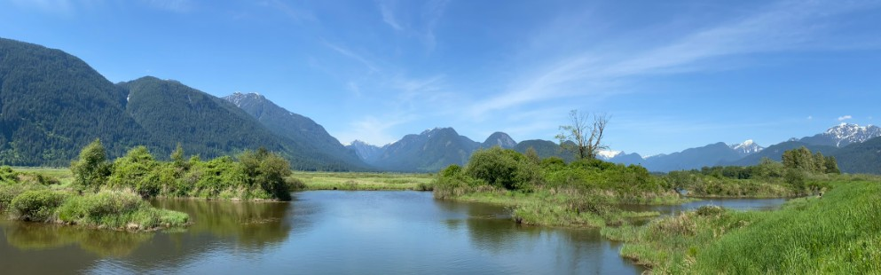

> “There are no passengers on spaceship earth. We are all crew.”\
> ― **Marshall McLuhan**

::: column-page

:::

# Welcome

I am a researcher who focuses on producing practical and solutions oriented science. I am particualrly interested in the intersection of decision science, salmon ecology, and spatial analysis and how bringing these disciplines together can help us better understand and steward complex social-ecological systems.

::: {layout-ncol="3"}
### Decision Science

Decision analysis provides the lense through which I approach problems of conservation and natural resource management. Using this framework helps to ensure that the questions I address are relevant to informing decisons.

### Salmon and Forests

Salmon are a keystone species in coastal temperate rainforests. They embody many of challenges inherent in achieving sustainable and productive landscapes that support both human and ecological values.

### Spatial Analysis and Data

Many of the challenges we face in stewarding ecosystems are inherently spatial in nature. I use spatial analysis to better understand these systems and to develop tools that can support decision-making.
:::
