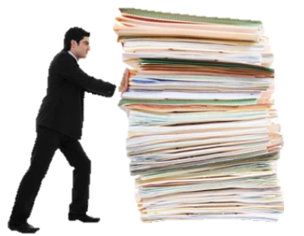

::: column-margin

:::

**Finn, R.J.R.**, T.G. Martin, V. Tulloch, A. Murdoch, S. Lyons, W. Moir, M. Milligan, E.B.J. MacDonald, and C. Mantyka-Pringle. 2026. A systematic review of ecological thresholds for salmon watersheds. *Environmental Reviews. In Review.*

**Finn, R.J.R.**, M.S. Adams, V.J. Tulloch, C. Service, J. Moody, J. Slade, S. Avery-Gomm, M.L. Bourbonnais, B. Penn, and T.G. Martin. 2026. Assessing cumulative effects to support Indigenous-led ecosystem-based management in salmon watersheds. FACETS. <https://doi.org/10.1139/facets-2025-0082>.

Dakin-Kuiper, S., J.W. Moore, **R.J.R. Finn**, N.C. Sainsbury, D. C. Whited, and T.G. Martin. 2026. Salmon watershed archetypes: a clustering of cumulative pressures and climate change. Ecological Solutions and Evidence. <https://doi.org/10.1002/2688-8319.70200>.

**Finn, R. J. R**., M. Ned - Kwilosintun, L. Ballantyne, I. Hamilton, J. Kwo, R. Seymour-Hourie, D. Carlson, K.E. Walters, J. Grenz, and T.G. Martin. 2024. Reclaiming the Xhotsa: Climate Adaptation and Ecosystem Restoration via the Return of Sumas Lake. *Frontiers in Conservation Science* 5: 1380083. <https://doi.org/10.3389/fcosc.2024.1380083>.

Tulloch, V. J. D., M. Adams, **R. Finn**, M. Bourbonnais, S. Avery-Gomm, B. Penn, T.G. Martin. 2023. Predicting Regional Cumulative Effects of Future Development on Coastal Ecosystems to Support Indigenous Governance. *Journal of Applied Ecology* 61(7): 1728–42. <https://doi.org/10.1111/1365-2664.14659>.

Chalifour, L., C. Holt, A.E. Camaclang, M. Bradford, R. Dixon, **R.J.R. Finn**, V. Hemming, S.G. Hinch, C.D. Levings, M. MacDuffee, D. Nishimura, M. Pearson, J.D. Reynolds, D.C. Scott, U. Spremberg, S. Stark, J. Stevens, J.K. Baum, and T.G. Martin. 2022. Identifying a pathway toward recovery for depleted wild Pacific salmon populations in a large watershed under multiple stressors. Journal of Applied Ecology 59: 2212-2226. [https://doi.org/10.1111/1365-2664.1423964](https://doi.org/10.1111/1365-2664.14239)

**Finn, R.J.R**., L. Chalifour, S.E. Gergel, S.G. Hinch, D.C. Scott, and T.G. Martin. 2023. Using systematic conservation planning to inform restoration of freshwater habitat and connectivity for salmon. Conservation Science and Practice 5(8): e12973. <https://doi.org/10.1111/csp2.12973>.

Hemming, V., A.E. Camaclang, M.S. Adams, M. Burgman, K. Carbeck, J. Carwardine, I. Chadès, L. Chalifour, S.J. Converse, L.N.K Davidson, G.E. Garrard, **R. Finn**, J.R. Fleri, J. Huard, H.J. Mayfield, E.M. Madden, I. Naujokaitis-Lewis, H.P. Possingham, L. Rumpff, M.C. Runge, D. Stewart, V.J.D. Tulloch, T. Walshe, and T.G. Martin. 2022. An Introduction to Decision Science for Conservation. Conservation Biology 36(1): e13868. <https://doi.org/10.1111/cobi.13868>.

**Finn, R.J.R**., L. Chalifour, S.E. Gergel, S.G. Hinch, D.C. Scott, and T.G. Martin. 2021. Quantifying lost and inaccessible habitat for Pacific salmon in Canada’s Lower Fraser River. Ecosphere 12(7): e03646. <https://doi.org/10.1002/ecs2.3646>.
