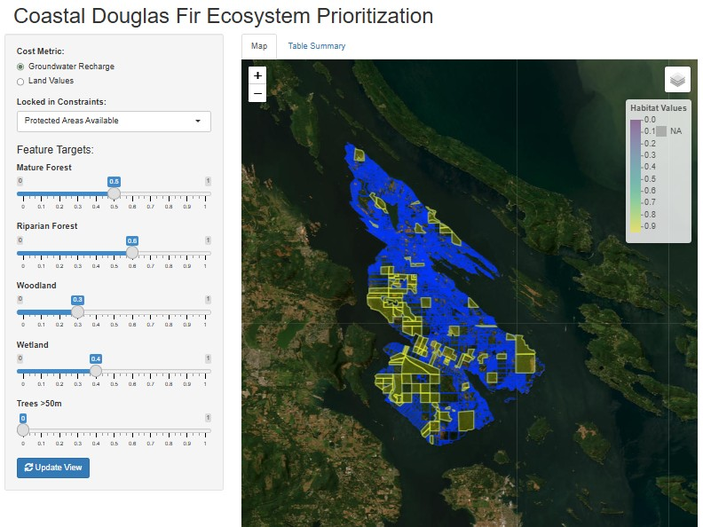
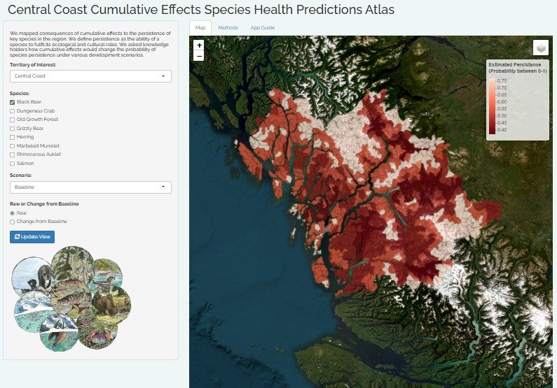

I have a particular interest in extending the products of my research into interactive tools that can be used for teaching and supporting decisons making. I believe that many concepts and ideas have been developed with in the scientific literature to aid in the managment of cumulative effects but their impact is limited by technological development. 

### Teaching Spatial Optimization

::: {layout-ncol=2}

Spatial optmization is a widely used tool for conservation planning, but it can be a difficult concept to teach. To help with this I developed an interactive web application that allows students to explore how different parameters influence the results of a spatial optimization analysis. 

:::

### Bayesian Network Cumulative Effects

::: {layout-ncol=2}

Part of the [Central Coast Cumulative Effects Project](projects.qmd#Central Coast Cumulative Effects) involved using Bayesian network models to predict the cumulative effects of future development scenarios on coastal ecosystems. To help communicate these results I developed an interactive web application that allows users to explore the predicted effects of different development scenarios on each of the focal species that were selected as well as any combination of those species. 
You can learn about the methods from the [paper](https://doi.org/10.1111/1365-2664.14659), and access the application [here](https://ubcconservationdecisionslab.shinyapps.io/ccce_app_cc/). 
:::

